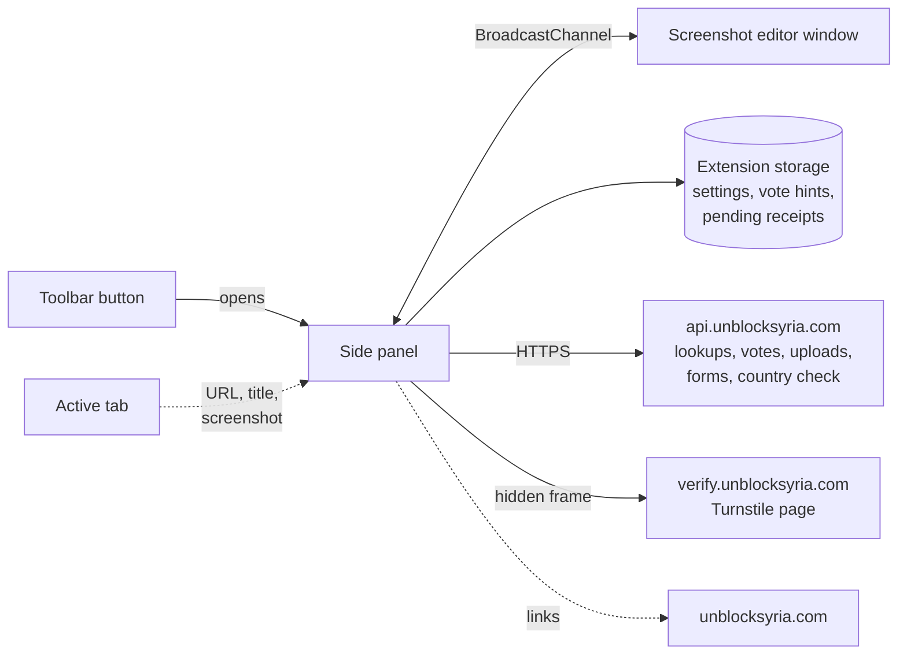
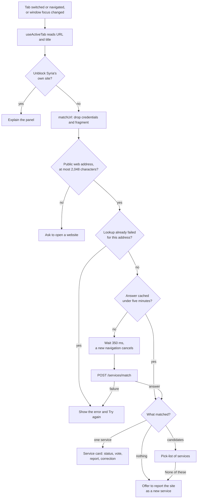
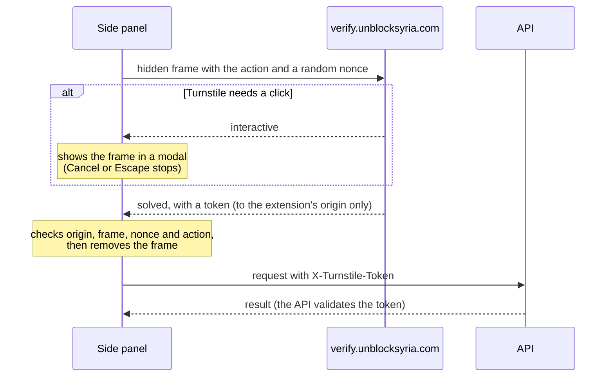
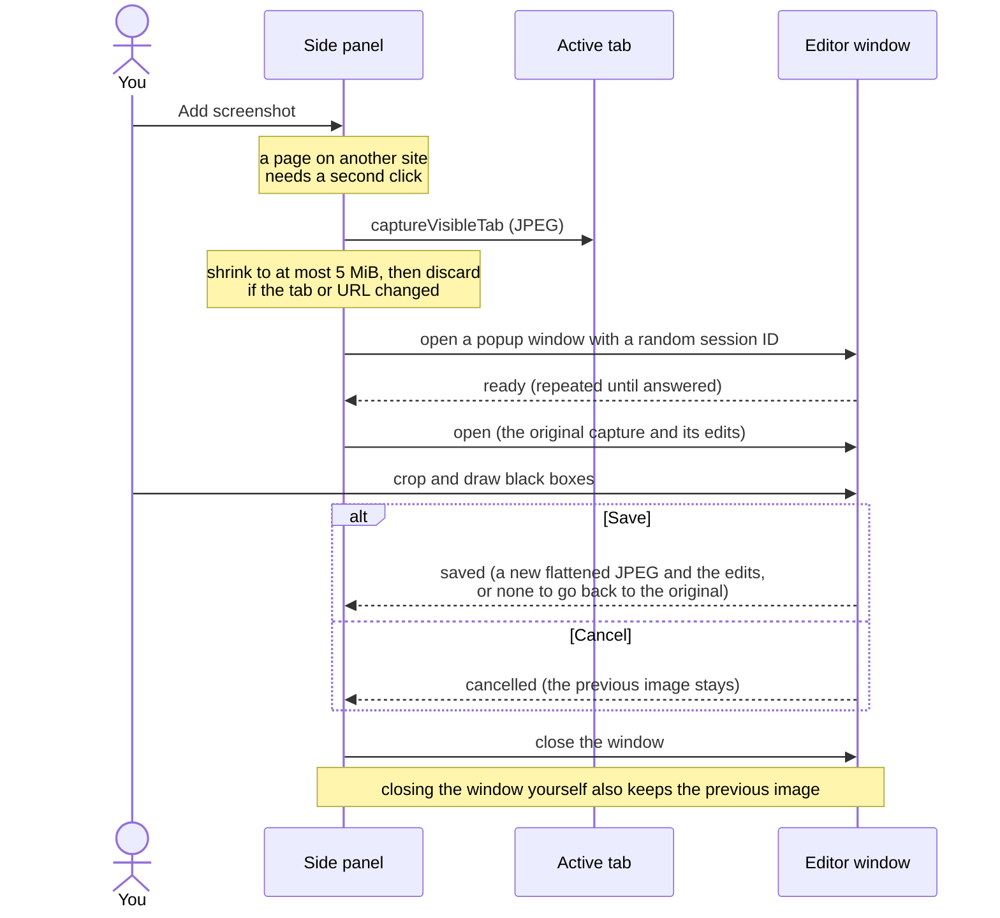
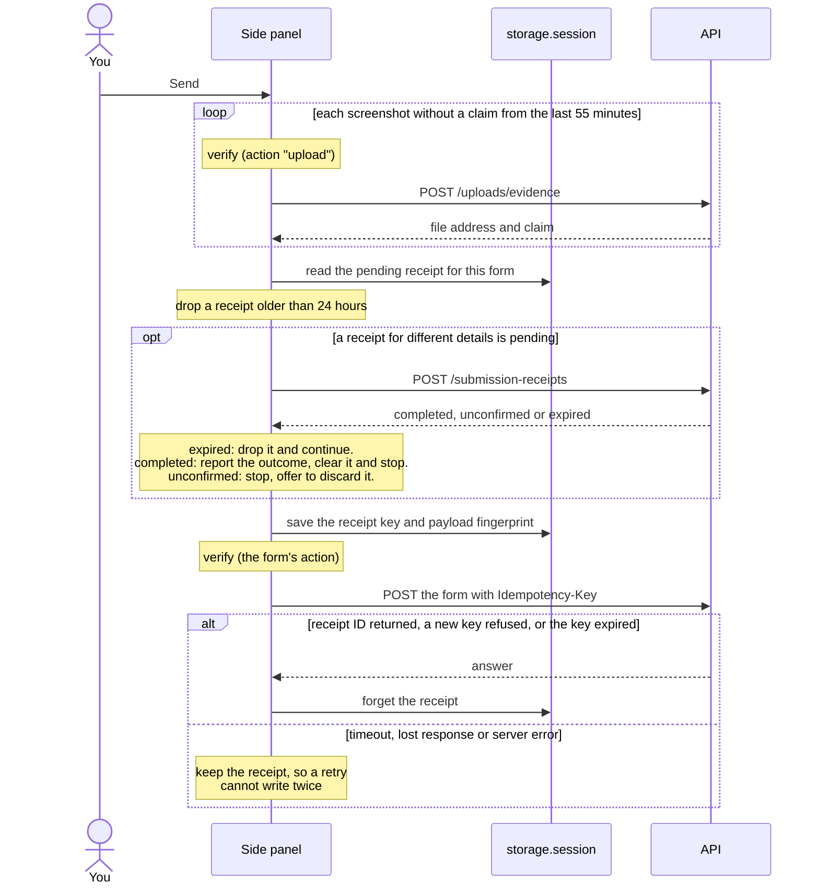

# Architecture

Shaghal is a Manifest V3 extension built with WXT, React and TypeScript. Its side
panel follows the active tab, matches it to an Unblock Syria service, and offers
votes and moderated submissions. The extension has no backend or private API key.

## Overview

The extension's work happens in two extension pages: the side panel and the
screenshot editor window. The background worker only tells Chrome to open the
panel from the toolbar button. Nothing is injected into the pages you visit.

## Code map

| Location                                                                                                                                                                                             | Responsibility                                                                                                                                               |
| ---------------------------------------------------------------------------------------------------------------------------------------------------------------------------------------------------- | ------------------------------------------------------------------------------------------------------------------------------------------------------------ |
| [background.ts](extension/src/entrypoints/background.ts)                                                                                                                                             | Makes the toolbar button open the side panel.                                                                                                                |
| [sidepanel](extension/src/entrypoints/sidepanel)                                                                                                                                                     | The panel page. `main.tsx` applies the theme and language before the first paint.                                                                            |
| [SidePanelApp.tsx](extension/src/entrypoints/sidepanel/SidePanelApp.tsx)                                                                                                                             | Chooses the page card, a form or Settings. Loads a service's full record before opening its report or correction form. Settings opens over the current view. |
| [sidepanel/hooks](extension/src/entrypoints/sidepanel/hooks)                                                                                                                                         | Following the active tab, debounced matching and the country check.                                                                                          |
| [PageCard.tsx](extension/src/entrypoints/sidepanel/components/PageCard.tsx)                                                                                                                          | What the panel shows for the page: a service card with voting, a pick-list, or an offer to report a new service.                                             |
| [sidepanel/components](extension/src/entrypoints/sidepanel/components)                                                                                                                               | The report, correction and new-service forms, and the VPN warning.                                                                                           |
| [FormParts.tsx](extension/src/entrypoints/sidepanel/components/FormParts.tsx)                                                                                                                        | Shared form controls and the screenshot lifecycle.                                                                                                           |
| [editor](extension/src/entrypoints/editor)                                                                                                                                                           | The separate screenshot editor window.                                                                                                                       |
| [ScreenshotEditor.tsx](extension/src/components/editor/ScreenshotEditor.tsx)                                                                                                                         | Crop, black boxes, undo/redo and discard confirmation.                                                                                                       |
| [components/ui](extension/src/components/ui)                                                                                                                                                         | Buttons, inputs, radio groups and the brand header.                                                                                                          |
| [api.ts](extension/src/lib/api.ts), [endpoints.ts](extension/src/lib/endpoints.ts)                                                                                                                   | The API client, and one typed, validated function per route.                                                                                                 |
| [submit.ts](extension/src/lib/submit.ts), [receipts.ts](extension/src/lib/receipts.ts)                                                                                                               | Form submissions and their receipts.                                                                                                                         |
| [turnstile.ts](extension/src/lib/turnstile.ts)                                                                                                                                                       | Human verification through the verification page.                                                                                                            |
| [url.ts](extension/src/lib/url.ts), [geo.ts](extension/src/lib/geo.ts)                                                                                                                               | Which page addresses are looked up, and the country check.                                                                                                   |
| [evidence.ts](extension/src/lib/evidence.ts), [editorWindow.ts](extension/src/lib/editorWindow.ts), [imageEdits.ts](extension/src/lib/imageEdits.ts), [imageBake.ts](extension/src/lib/imageBake.ts) | Capture, resizing and upload; the editor window's messages; crop and box geometry; drawing edits into a new JPEG.                                            |
| [settings.ts](extension/src/lib/settings.ts), [votes.ts](extension/src/lib/votes.ts), [theme.ts](extension/src/lib/theme.ts), [i18n.ts](extension/src/lib/i18n.ts)                                   | Saved email and language, vote hints, the theme, and the active language and direction.                                                                      |
| [locales](extension/src/locales)                                                                                                                                                                     | English and Arabic panel text. The store name and description are in [public/\_locales](extension/public/_locales).                                          |
| [theme.css](extension/src/styles/theme.css)                                                                                                                                                          | Shared styles and light/dark tokens.                                                                                                                         |
| [testing](extension/src/testing)                                                                                                                                                                     | Unit test helpers: a fake API that refuses real hosts, JSON fixtures, and `openPanel`, which mounts the panel on a fake tab.                                 |
| [e2e](extension/e2e)                                                                                                                                                                                 | Browser tests of the production bundle, with external requests stubbed.                                                                                      |

There are no content scripts, injected page scripts, external messaging handlers,
or background polling. Page content cannot invoke votes, uploads or captures
through an extension message API. React renders API text without raw HTML.

## Following the page

[useActiveTab](extension/src/entrypoints/sidepanel/hooks/useActiveTab.ts) re-reads
the active tab on every switch, navigation and focus change, and ignores
out-of-order answers. [useServiceMatch](extension/src/entrypoints/sidepanel/hooks/useServiceMatch.ts)
does the lookup. A new navigation aborts the pending request, although the server
may already be handling it.

[matchUrl](extension/src/lib/url.ts) skips non-web pages, IP addresses,
single-label hosts, common local domains, and addresses longer than the API's
2,048-character limit. It keeps the path and query, which some services need for
matching. Sending the address in a POST body keeps it out of URL logs, but the
query can still hold private data.

The cache holds up to 100 successful answers in memory and evicts the oldest. The
panel never polls: an unchanged page is not looked up again, and a failed one
waits for Try again. **None of these** and the new-service offer open a form
prefilled with the site's scheme and host (without `www.`) and the tab title.

## API boundary

[api.ts](extension/src/lib/api.ts) sends each request once, with a 60-second network
timeout that starts after verification. It omits cookies and referrers, rejects
redirects, and returns a typed success/error result. Read and vote responses are
validated before UI code uses them; form submissions require a receipt ID.
Malformed responses become errors. A timeout or lost response can leave a write's
outcome uncertain.

| Route                                                         | Used for                                                     |
| ------------------------------------------------------------- | ------------------------------------------------------------ |
| `POST /services/match`                                        | Matching the page to a service.                              |
| `GET /services/:slug`                                         | The full record for the report and correction forms.         |
| `GET /functionalities`, `GET /categories`                     | Part and category names for the report and correction forms. |
| `POST`, `DELETE /services/:slug/vote`                         | Casting or removing a vote. Verified.                        |
| `POST /uploads/evidence`                                      | Uploading one screenshot. Verified.                          |
| `POST /functionality-reports`, `/corrections`, `/submissions` | Sending a form. Verified, with an `Idempotency-Key`.         |
| `POST /submission-receipts`                                   | Asking what happened to an earlier, unconfirmed send.        |

[receipts.ts](extension/src/lib/receipts.ts) protects form sends from being
written twice. Each send gets a random key, stored in session storage with a hash
of the request body. There is one pending receipt per service for reports and
corrections, and one shared by all new-service submissions. Resending the same
body reuses the key, and the API answers a repeated key with the original result.
A different body first asks `POST /submission-receipts` what happened to the
earlier send; the sequence is in [Forms and screenshots](#forms-and-screenshots).
A receipt the API no longer knows (it answers `expired`, or the key is over 24
hours old) is dropped. One it can't confirm blocks new details until you resend
the originals or choose **Discard earlier attempt**. The panel never resends on
its own, and won't send at all if session storage is unavailable.

On a 429, forms show how long to wait, read from `Retry-After` (seconds or an
HTTP date). Client-side validation only saves wasted requests; it is not an
anti-abuse measure.

| Build       | API                            | Site links                 | Verification                      |
| ----------- | ------------------------------ | -------------------------- | --------------------------------- |
| Development | `http://localhost:8787`        | `http://localhost:3000`    | `http://localhost:8790`           |
| Production  | `https://api.unblocksyria.com` | `https://unblocksyria.com` | `https://verify.unblocksyria.com` |

`WXT_API_BASE`, `WXT_SITE_BASE` and `WXT_VERIFY_BASE` override these at build time.
Any build whose API is on `localhost` or `127.0.0.1` skips client verification.

The country check bypasses the API client: [geo.ts](extension/src/lib/geo.ts)
fetches `https://api.unblocksyria.com/cdn-cgi/trace` in every build, with a
10-second timeout. It only drives the VPN warning in the report and new-service
forms.

## Human verification

[turnstile.ts](extension/src/lib/turnstile.ts) frames
`/extension/turnstile?action=<action>&nonce=<uuid>` on the verification host.
The page returns an `unblocksyria-turnstile` message with the nonce, action and
status: `interactive`, `solved` with a `token`, or `error` with a `code`.

Every write needs its own token: each vote change, each screenshot upload and the
form itself. Builds with a loopback API skip verification.

The panel accepts messages only from its own frame, from the exact verification
origin, with the expected nonce and action. It ignores a token that is blank or
longer than 2,048 characters. The page has 30 seconds to load and an interactive
challenge two minutes; repeated messages don't extend either deadline.

The client checks don't replace
[server validation](https://developers.cloudflare.com/turnstile/get-started/server-side-validation/)
of the token, action and hostname. Tokens are single-use and expire after five
minutes. The manifest key and extension ID identify the client, but they are not
credentials.

## Forms and screenshots

### Votes

[votes.ts](extension/src/lib/votes.ts) keeps a local hint of which services this
browser voted for. The API is the source of truth: `ALREADY_VOTED` and
`NO_VOTE_FOUND` answers correct the hint, and a failure to save the hint never
turns an accepted vote into an error. Removing a vote takes a second click within
three seconds. Services that already work can't be voted for.

### Forms

- A report sends only the parts you marked, each with a note or a screenshot. It
  can have up to 30 parts and 100 screenshots, five per part.
- A correction sends all changed fields in one submission. Categories go as a
  JSON array of up to ten IDs.
- A new service needs a name (up to 200 characters); the description is capped at
  2,000.
- Corrections and new services take up to ten screenshots.

### Screenshots

Screenshots and their edit history stay in memory; none is written to storage.

1. **Capture.** In the report and new-service forms, a page on a different site
   from the form's needs a second click. The capture is resized to fit the API's
   5 MiB limit, and dropped if the tab or its URL changed meanwhile.
2. **Edit.** A popup window opens the editor over a `BroadcastChannel` with a
   random session ID. Only one editor is open at a time. If the window can't be
   created, the editor opens inside the panel instead.
3. **Save.** The crop and black boxes are drawn onto the original capture as a
   new JPEG, resized again if needed. The original stays for later edits; only
   the rendered image is uploaded.
4. **Send.** Each screenshot is verified and uploaded in turn, then the form is
   verified and sent. Sending waits for any capture or open editor, and the
   form is disabled while it sends.
5. **Retry.** An upload's claim is reused for 55 minutes, inside the API's one-hour
   expiry. Editing a screenshot invalidates its claim. A failed send doesn't
   delete uploads already made.

Capture and edit (steps 1 to 3):

Send and retry (steps 4 and 5):

An upload's claim is what lets a submission attach it. The API expires uploads
that are never attached, but until then one may be readable at its address.
Attached screenshots stay readable by anyone with the address, and the extension
can't delete an upload.

Drafts live only in memory. Back asks before discarding changes, and Settings
opens over the form without unmounting it. Closing the panel loses the draft; the
unload warning is best effort.

## Language and theme

[i18n.ts](extension/src/lib/i18n.ts) sets up i18next with the catalogs in
[locales](extension/src/locales). `en.ts` defines every key. `ar.ts` adds Arabic
plural forms, and any key it leaves out falls back to English. The `system` choice
follows the browser's language. The active language sets `lang` and `dir` on the
page, the `/en` or `/ar` path of site links, and the `locale` sent to the API.

[theme.ts](extension/src/lib/theme.ts) stores the System, Light or Dark choice and
sets `data-theme` on the page; [theme.css](extension/src/styles/theme.css) resolves
its colors with `light-dark()`. The editor window is always dark.

## Permissions and storage

| Permission   | Why                                                                                    |
| ------------ | -------------------------------------------------------------------------------------- |
| `tabs`       | Read the active tab's URL and title.                                                   |
| `sidePanel`  | Show the panel.                                                                        |
| `storage`    | Keep settings, vote hints and pending receipts.                                        |
| `<all_urls>` | Capture screenshots of any site the panel follows, and reach the API (or a local one). |

`activeTab` would be narrower, but its grant ends on navigation, so every new page
would need another toolbar click; see
[Chrome's permission model](https://developer.chrome.com/docs/extensions/develop/concepts/activeTab).

| Store                    | Keys                                                                          | Lifetime                                            |
| ------------------------ | ----------------------------------------------------------------------------- | --------------------------------------------------- |
| `chrome.storage.local`   | `testerEmail`, `language`, `voteHint:<slug>` (and legacy `votedServiceSlugs`) | Until cleared                                       |
| `chrome.storage.session` | `pendingReceipt:<path>:<target>`                                              | Until the browser restarts or the extension reloads |
| `localStorage`           | `theme`                                                                       | Until cleared                                       |

The saved email changes only after a successful submission with an email, or in
Settings, where saving it blank clears it. Vote hints are separate keys, so panels
update each other through storage events without overwriting each other. No
browsing history or screenshot is stored. Service logos load from the hosts the
API supplies, without a referrer.

Chrome 123 is the minimum, for CSS `light-dark()`. Other Chromium browsers need
the same side panel API and aren't tested.

## Abuse boundaries

Anyone can call the public API directly, from a modified extension or a script.
CORS, the extension ID, disabled buttons and vote hints don't prevent that, so the
server enforces verification, quotas, vote uniqueness, upload checks and
moderation for every client. The extension holds no credential that bypasses them.

## Validation

`npm run check` runs ESLint on `src`, Prettier, TypeScript, Vitest and a production
build. `npm run test:e2e` loads the last build into Chromium. Unit tests fail on
any unstubbed fetch; browser tests stub every HTTP(S) request, including the
verification page, and fail on unknown ones. Neither suite writes to the live
service.

The browser tests open the panel as a tab, not a native side panel. Real Turnstile
challenges, the live API and assistive-technology checks are not covered.
