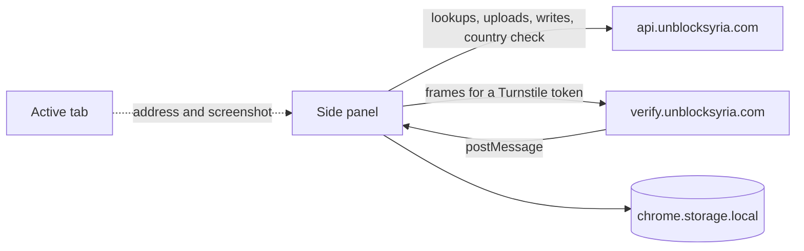
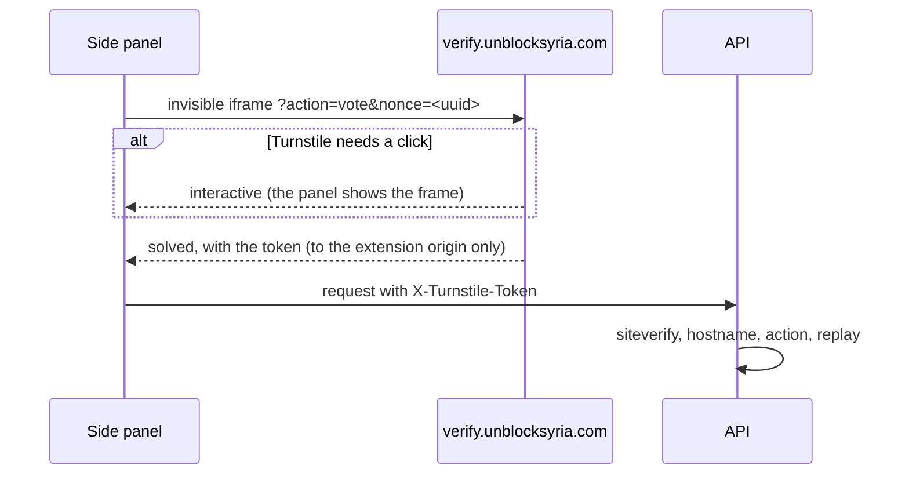

# Architecture

Shaghal (شغّال) is a Manifest V3 side panel for Chromium browsers. It follows the
active tab, shows whether that site works from Syria, and lets anyone vote, report
what works, suggest a correction or report a missing service.

It is a second client of the Unblock Syria API, alongside unblocksyria.com. It has no
backend and no secrets, and every rule against abuse is enforced on the server.

## Code map

| Path | What it holds |
|---|---|
| [entrypoints/background.ts](extension/src/entrypoints/background.ts) | Makes the toolbar button open the panel. Nothing else runs in the background. |
| [entrypoints/sidepanel/](extension/src/entrypoints/sidepanel/) | The panel. [SidePanelApp.tsx](extension/src/entrypoints/sidepanel/SidePanelApp.tsx) switches between the page card, the three forms and Settings. There is no router and no global store. |
| [lib/](extension/src/lib/) | Everything that isn't UI: config, the API client and calls, verification, evidence, votes, the country check, settings and theme. |
| [entrypoints/editor/](extension/src/entrypoints/editor/) | The screenshot editor's window. It gets its screenshot from the panel and sends the edited one back. |
| [components/editor/](extension/src/components/editor/) | The screenshot editor itself: one surface with no modes, where the crop frame is always on the image and a drag draws a black box. Undo, redo, and a question before edits are thrown away. |
| [components/ui/](extension/src/components/ui/), [theme.css](extension/src/styles/theme.css) | Shared controls, and the website's design tokens as `light-dark()` pairs. |

## Knowing the page

[useActiveTab](extension/src/entrypoints/sidepanel/hooks/useActiveTab.ts) follows the
shown tab's address and title. [useServiceMatch](extension/src/entrypoints/sidepanel/hooks/useServiceMatch.ts)
then asks `POST /services/match` which service that page belongs to:

- The address goes in the request body, so it stays out of request logs.
- Lookups wait 350 ms for redirects to settle.
- Answers are cached while the panel is open, keyed by the address without its fragment.

The answer is one service, a pick-list for a site hosting several, or nothing, which
offers "Report a Service". Unblock Syria's own pages show
[HowItWorks](extension/src/entrypoints/sidepanel/components/HowItWorks.tsx) instead.

## Talking to the API

Every request goes through [api.ts](extension/src/lib/api.ts):
- Each request is sent once, with a 60-second timeout.
- It resolves to `{ ok, data }` or `{ ok: false, error }` and never throws.
- A 429 comes back with `retryAfterSeconds` for the form to show.

[config.ts](extension/src/lib/config.ts) picks the hosts:

| Build | API | Site links | Verification page |
|---|---|---|---|
| `npm run dev` | `http://localhost:8787` | `http://localhost:3000` | `http://localhost:8790` |
| `npm run build` | `https://api.unblocksyria.com` | `https://unblocksyria.com` | `https://verify.unblocksyria.com` |

`WXT_API_BASE`, `WXT_SITE_BASE` and `WXT_VERIFY_BASE` override these at build time.
The API doesn't list the extension in CORS; `<all_urls>` lets the panel reach it anyway.

## Human verification

Votes, reports, corrections and new services each need a single-use Turnstile token.
Extension pages can't run Turnstile: MV3 forbids remote scripts, and Cloudflare can't
allowlist a `chrome-extension://` origin. So [turnstile.ts](extension/src/lib/turnstile.ts)
frames a page on our own domain that can:

- **What the panel accepts:** only messages from that origin and its own frame, whose
  nonce and action match the request.
- **Who the page admits:** only the store extension's origin,
  `epmjhaoobmgfclbkelhkiakijjocjgfm`. The store key in
  [wxt.config.ts](extension/wxt.config.ts) gives unpacked builds that ID too.
- **Browsers:** Chromium browsers installing from the Chrome Web Store share the ID.
  Firefox gives each install a random origin, so there's no Firefox build.
- **Not a security boundary:** the key is public, so anyone can load a copy with that
  ID, just as anyone can script the website's own widget. Either way, each token
  costs a solve.
- **Local API:** a local API runs without human verification, and the panel asks for
  no token.

## Writes and evidence

- **Votes** ([votes.ts](extension/src/lib/votes.ts)):
  - The API counts one vote per network address per service.
  - It can't be asked whether a vote exists, so the panel remembers its own votes as
    a hint. `ALREADY_VOTED` and `NO_VOTE_FOUND` answers correct that hint.
  - Voting closes once a service is available.
- **Report what works**
  ([ReportForm.tsx](extension/src/entrypoints/sidepanel/components/ReportForm.tsx)):
  - Each part starts at the level the service records.
  - A part is sent when it says something new, or when it confirms the record with a
    note or screenshot.
  - A part that contradicts the record needs a note or a screenshot.
- **Suggest Correction**
  ([CorrectionForm.tsx](extension/src/entrypoints/sidepanel/components/CorrectionForm.tsx)):
  - One submission can change several fields.
  - Categories are sent as a JSON array of category IDs, at most ten.
- **Report a Service**
  ([ReportServiceForm.tsx](extension/src/entrypoints/sidepanel/components/ReportServiceForm.tsx)):
  the open site's address, with its name taken from the page title.
- **VPN warning:** both report forms read the connection's country from
  `api.unblocksyria.com/cdn-cgi/trace` ([geo.ts](extension/src/lib/geo.ts)). Outside
  Syria, [VpnWarning](extension/src/entrypoints/sidepanel/components/VpnWarning.tsx)
  asks the tester to turn their VPN off. It never blocks sending.

Screenshots ([evidence.ts](extension/src/lib/evidence.ts),
[FormParts.tsx](extension/src/entrypoints/sidepanel/components/FormParts.tsx)):

1. **Capture:** `captureVisibleTab` takes the visible page as a JPEG, scaled down if
   it's over the API's 5 MB cap.
2. **Site check:** if the tab has moved to another site since the report was opened,
   capturing it takes a second press.
3. **Edit:** each capture opens the editor straight away, and clicking a thumbnail
   opens it again. It is a popup window laid over the browser window
   ([editorWindow.ts](extension/src/lib/editorWindow.ts)), because the panel is too
   narrow to cover small text precisely. The panel and the window pass the image
   over a `BroadcastChannel`, so it is never stored, and the panel closes the window
   once it has the answer. When no window can open, the editor opens inside the panel.
   Saving draws a new JPEG from the kept pixels with the boxes painted black
   ([imageBake.ts](extension/src/lib/imageBake.ts)), so nothing hidden is in the file.
   Black, not blur, because a blur can sometimes be reversed on text. The capture and
   its edits ([imageEdits.ts](extension/src/lib/imageEdits.ts)) stay in the panel, so
   reopening lets the edits be changed; only the edited copy is uploaded.
4. **Upload:** on send, each screenshot goes to `POST /uploads/evidence`, which
   returns a URL with a one-time `#claim=` key.
5. **Cite:** the form cites that URL. The API attaches each upload to one submission,
   within an hour. A retried send reuses the uploads, except for a screenshot edited
   since, which goes up again. Nothing can be sent while a screenshot is open in the
   editor, and a form's screenshots are locked while it sends, so what is sent is
   always what is shown.

Nothing the panel sends changes the public record directly; reports, corrections and
submissions all go to review queues.

## Where abuse is stopped

Checks in the panel are for the tester's benefit. Anyone can call the API directly,
so enforcement lives on the server, and the website gets the same rules:

| Control | What it bounds |
|---|---|
| Turnstile on votes, reports, corrections and submissions | Scripted writes: each one costs a solve on our page, for that endpoint. Uploads aren't checked. |
| Per-address rate limits | Votes: 30/min and 100/hr. Reports, corrections and submissions share 10/hr and 30/day. Uploads: 10/min and 30/hr. |
| One vote per address per service | Repeat votes |
| Review queues | Every data change; nothing is applied automatically |
| Upload claims | Citing someone else's upload, or a stale one |
| Pending-report cap per service | Flooding one service with reports awaiting review |
| Address denylist | Known bad networks |

These limits were accepted in September 2026. The bar is parity with the website:

- **Identity is the exact IP address.** An IPv6 user can rotate addresses within a
  /64 to get more votes, while Syrians behind one carrier-grade NAT address share a
  single vote and a single budget.
- **The optional email isn't verified,** but it decides volunteer credit and
  receives confirmation mail.
- **Uploads are public before they're claimed,** and GIF metadata isn't stripped.
- **The pending-report cap is per service, not per network,** so one network can
  fill it.

## Permissions, storage and privacy

- **Permissions:**
  - `tabs` reads the shown tab's address and title.
  - `<all_urls>` allows screenshots on any site and reaches the API.
  - `sidePanel` and `storage` are needed for the panel and settings.
  - Chrome 123 or later is required, for `light-dark()`.
- **Storage:**
  - `chrome.storage.local` holds the optional email (`testerEmail`) and the vote hint
    (`votedServiceSlugs`).
  - `localStorage` holds the theme, so it applies before first paint.
- **Privacy:**
  - Only the shown page's address is sent, and only while the panel is open.
  - Screenshots leave the machine only when their form is sent.
  - The country check goes to our own API host.

## Testing

`npm test` runs Vitest with WXT's in-memory browser APIs. It covers:
- the address helpers;
- the API client;
- the verification message contract;
- the country check;
- vote bookkeeping.

`npm run check` runs what CI runs: lint, the format check, typecheck, tests and a
production build. For end-to-end writes, run the API locally (see the
[README](README.md)); nothing then reaches the live review queues.
